# 바이브코딩 1일차

## VibeCoding with Codex/Cursor/Claude Code/Gemini

### AI에게 제대로 코딩을 시키자!

#### 1. 핵심 개념

코딩을 직접 작성하지말 것. AI와 협업해서 새로운 프로그램을 만들자!

##### 기본 개발방식

요구사항분석 >  설계(DB/UI 포함) > 구현 / 디버깅 > 테스트 > 배포 > 유지보수

##### 바이브코딩 방식

요구사항정의(PRD) / 사람 > 코드생성 / AI > 디버깅,테스트 / AI > 검증 및 수정 / 사람 > 배포 / 사람

##### 핵심 포인트

- AI -  주니어 개발자? 시니어 개발자!
- 사람 - PM + 리뷰어

#### Tip
문맥의 토큰을 어떻게 분리하는지 확인 사이트

- https://platform.openai.com/tokenizer

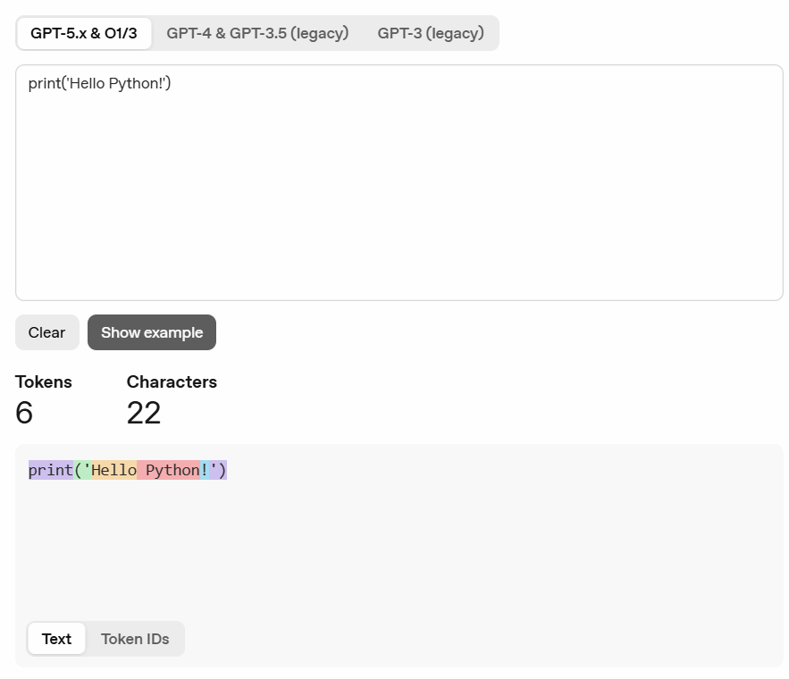

#### 2. 바이브코딩 개발 환경

여러방식 존재. 본인게 맞는 방식을 찾으세요

##### CLI 코딩 방식

콘솔(터미널, 파워쉘, bash)에서 바이브코딩

- node.js 패키지 모듈 명령어(npm)로 설치
- https://nodejs.org/ko/download
- node-v24.18.0-x64.msi 설치

###### ChatGPT - OpenAI Codex CLI

- 설치
```powershell
# 설치
> npm install -g @openai/codex

# 사용
> codex
```

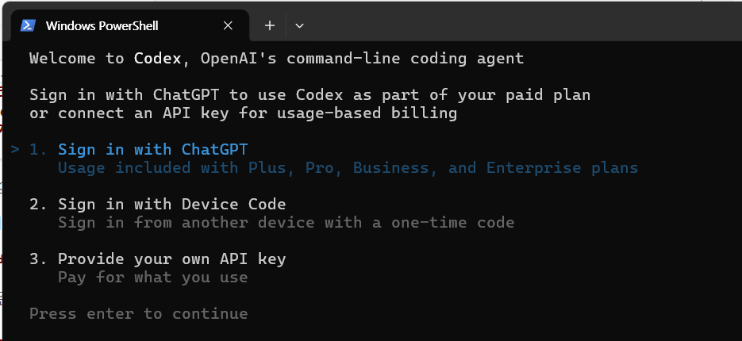

- 로그인 진행

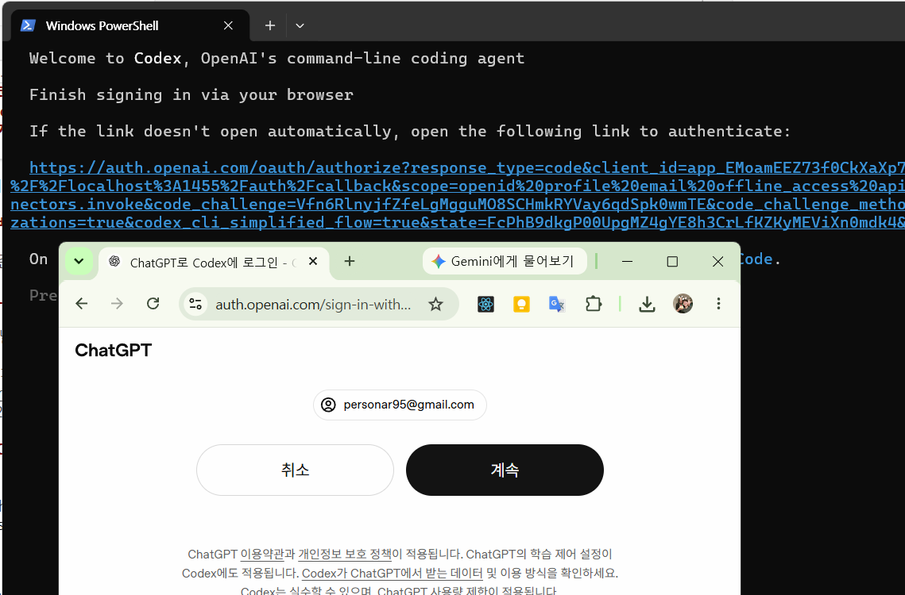

- 웹 브라우저 SSO로 계속

- 폴더 신뢰 여부 확인 뒤

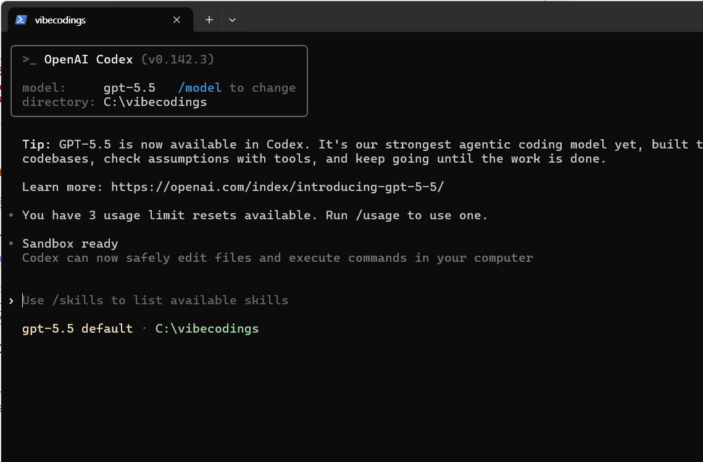

- 개발화면

- 기본 명령어 중 / 명령 수행

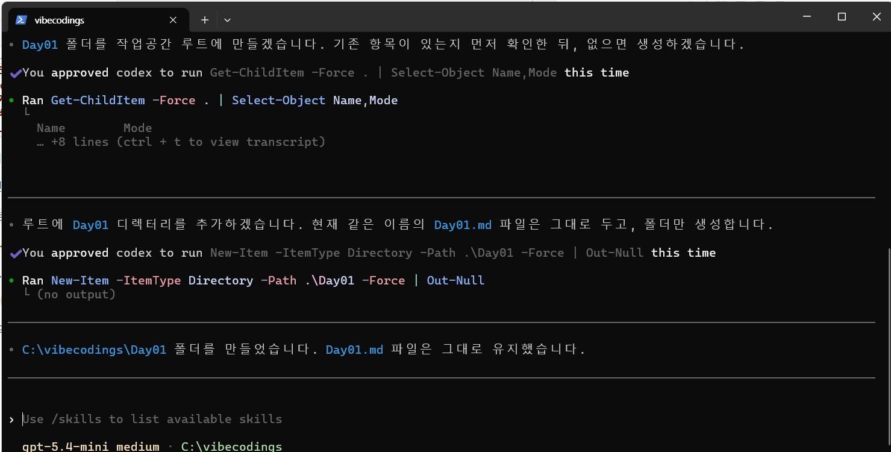

- 폴더 생성 명령 확인

###### Gemini CLI 

```powershell
# 설치
> npm install -g @google/gemini-cli

# 실행
> gemini
```

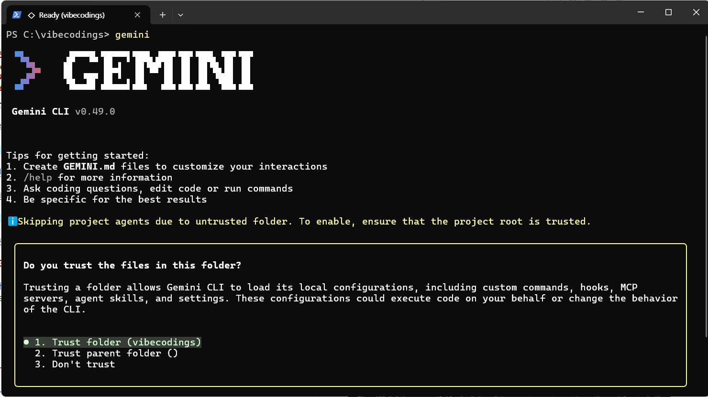


###### ClaudeCode CLI

```powershell
# 설치
> npm install -g @anthropic-ai/claude-code

# 실행
> claude
```

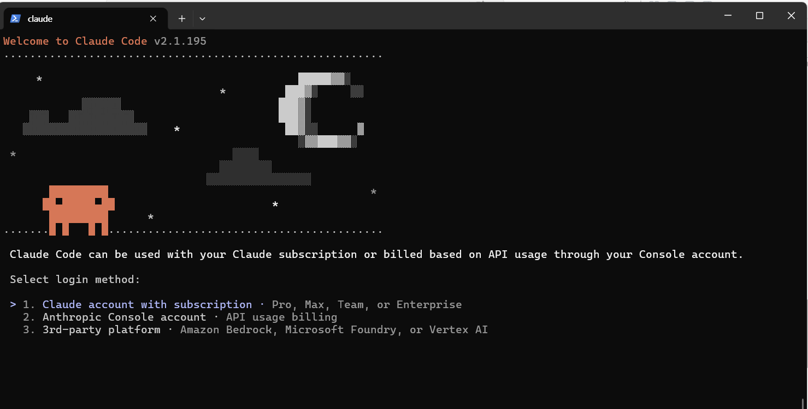


##### 웹브라우저 LLM 사용 방식

ChatGPT, 클로드, 제미나이 사이트 접속 바이브코딩

##### IDE 툴 확장툴 사용 방식

VS Code (Insider)의 확장 설치 바이브코딩

###### Codex 

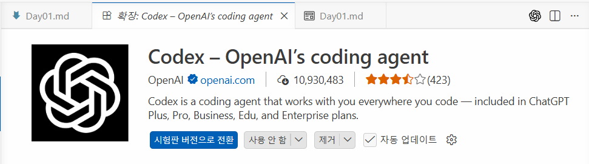

- 확장 > Codex 검색 > OpenAI 버전 Codex 설치

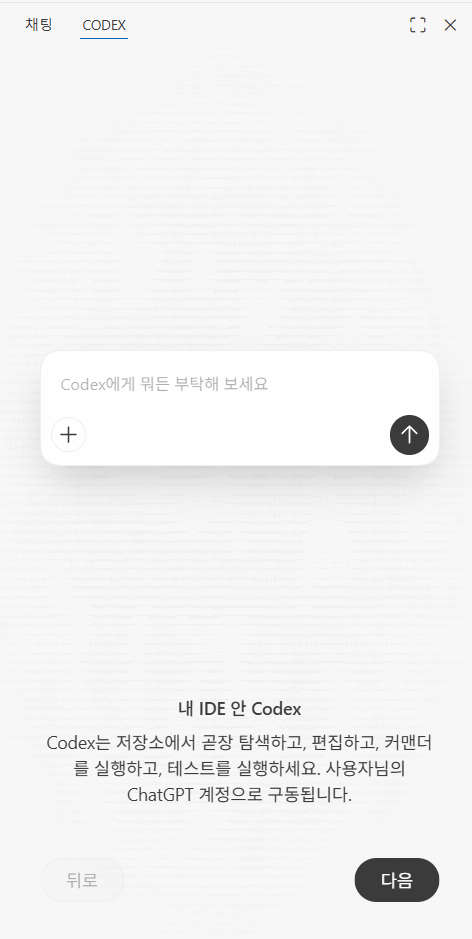


- 로그인


- Codex 실행화면

###### Gemini Code Assist

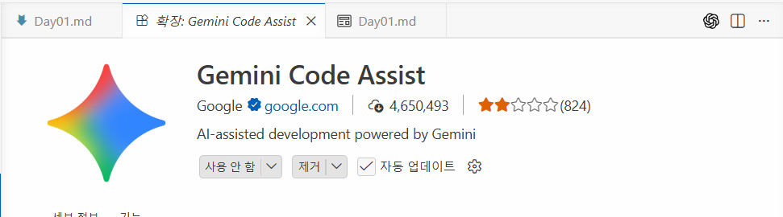

- 2026년 6월 18일 부터 VS Code 확장 사용불가. Enterprise는 지원
- Antigravity 사용 권장
- ~~확장 >  Gemini 검색, Google 버전 Gemini Code Assist 설치~~
- ~~설치 후 채팅 탭 ~~
- ~~로그인 후 사용~~

###### Claude Code for VS Code

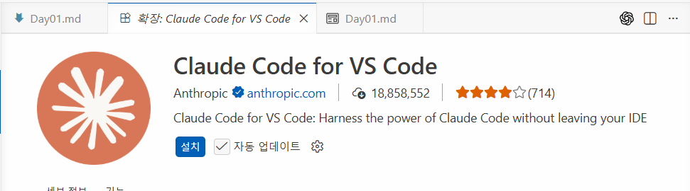

- Pro, Max 버전 이상 사용 가능
- 확장 > Claude 검색 후, Anthropic 버전 설치
- 위와 동일


#### 3. 바이브코딩 시작

##### 프롬프트 가이드

- LLM에 질문을 던지는 컨텍스트
- 간결한 프롬프트로 처리할 것
    - `주의를 살펴서 조심스럽게`, `자세히`, `조심스럽게...` 단어를 사용하지 말 것
    - `수정해줘`, `분석해줘`, `최적화해줘` 등 명령 형태로 문장은 완료할 것

##### 프롬프트 종류

- 제로샷 프롬프트 - 아무 예제없이 AI와 대화로 코딩을 시작하는 프롬프트 방식

- 원샷 프롬프트 - 예제 하나 정도 제공한 뒤 비슷한 작업을 수행하도록 요청하는 방식
 
- 퓨샷 프롬프트 - 2~5개 예제를 제공한 뒤 작업 수행 요청

##### ChatGPT, Gemini  웹 브라우저 바이브코딩

- 프롬프트는 명령아니고 설계도. 지시를 잘못하면 결과도 이상하게 나옴

```bash
# 나쁜 예
> 로그인을 만들어줘
> 뭔가 멋진 로그인을 만들어줘(?)

# 좋은 예
> 로그인 기능을 만들어줘. Python으로
```

- 좀더 개선된 프롬프트 작성 필요

```bash
# 개선 1차 - 원 샷 프롬프트
>
너는 백엔드 개발자야.

사용자 로그인 기능을 만들어줘. Python FastApi 사용해줘.
```

- 더욱 개선된 퓨샷 프롬프트 작성 

```bash
> 
너는 백엔드 개발자야.

사용자 로그인 API를 만들어줘.
- Python FastAPI 사용
- JWT 인증, OAuth2 
- 예외처리 포함 
```

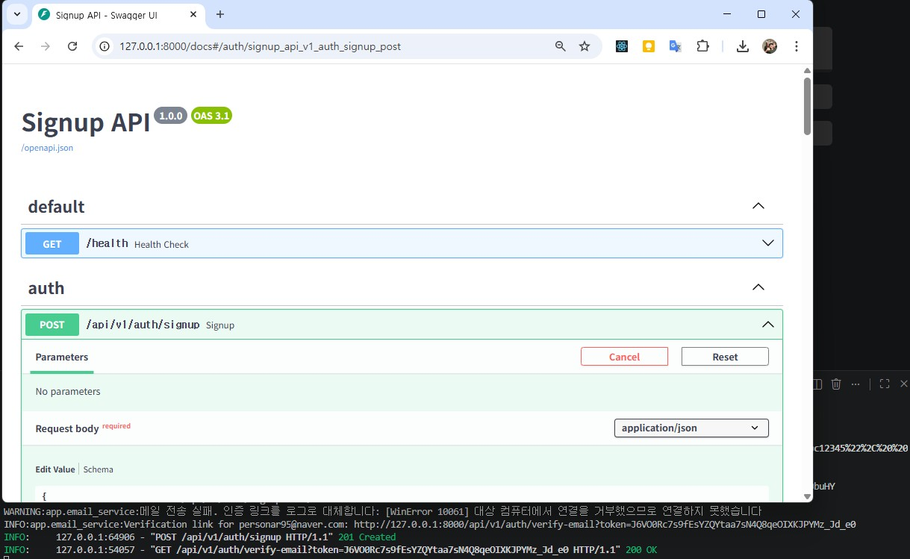

- 작성결과

###### 웹 브라우저 사용 바이브코딩 단점

- 나온 결과를 직접 구성. 폴더, 파일 개발자가 수동으로 처리
- 디버깅이 개발툴과 웹브라우저 LLM 사이에 전환하면서 처리
- CLI나 IDE 툴 확장으로 좀 더 편하게 바이브코딩하자

##### Codex, API 사용 바이브코딩 

- VS Code 등의 IDE툴 사용
- AI가 직접 폴더나 파일을 제어할 수 있음
- 디버깅도 실시간으로 가능. 배포도 AI가 해줄 수 있음

###### 에이전틱 코딩 - TODO List

- HTML, Javascript, CSS를 사용한 간단한 TODO 리스트 프로그램
- 프롬프트 영역에 작성 시 Shift+ Enter 로 여러줄 작성
- Enter는 실행

```markdown
HTML, CSS, Javascript를 사용해서 간단한 TODO 리스트를 만들어줘.

기능은 다음과 같아
- 할 일 추가
- 할 일 완료 체크
- 할 일 삭제
- 새로고침 전까지 브라우저에서 동작할 것
- 초보자가 이해하기 쉽게 작성
- 하나의 HTML 파일 CSS, Javascript모두 추가할 것
```

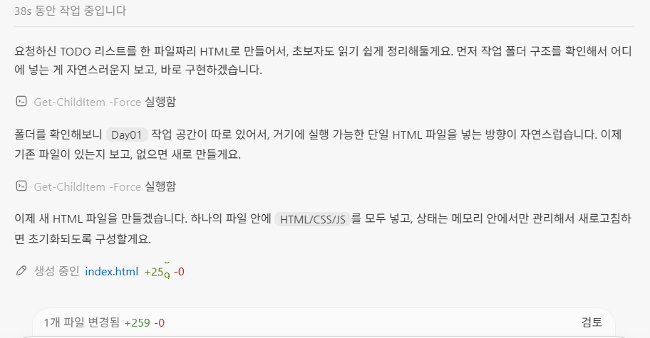


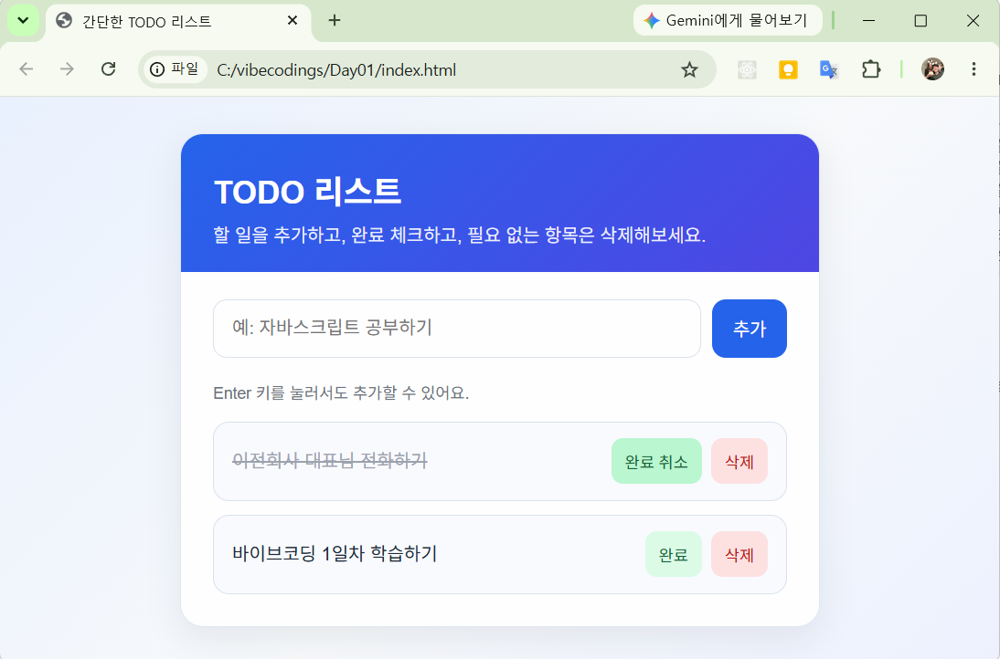

- 완성된 결과 화면

- 웹서버로 동작하는 게 아님

```markdown
현재 사용중인 VS Code Insider에 Live Server 확장을 설치해줘
```

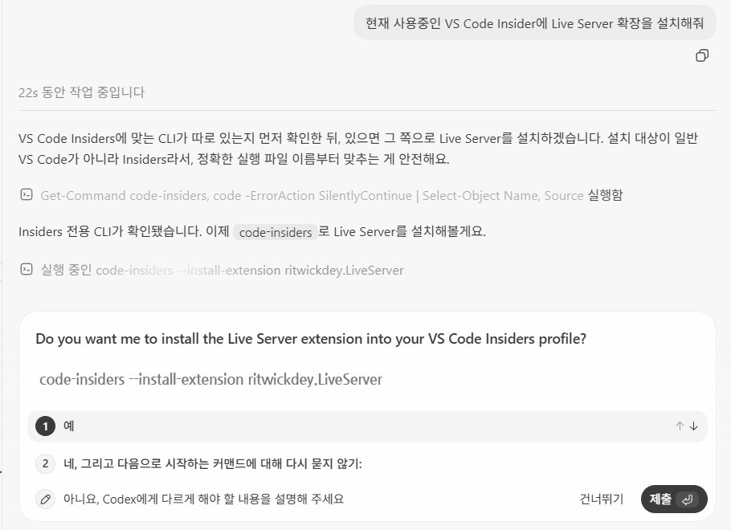

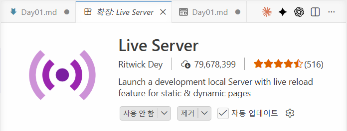

- 서버 실행명령

```markdown
좋아, Live Server로 조금전에 작성한 index.html을 실행해줘
```

- 서버 실행이 실패할 수도 있음

###### TODO List 개선

- Python 웹서비스와 연계

- Python 가상환경 설치 및 실행

```powershell
# Python 가상환경 설치
> python -m venv venv
# 가상환경 활성화
> .\venv\Scripts\Activate.ps1
(venv) > 
```

```markdown
너는 백엔드 개발자야.

Python FastAPI로 간단한 TODO API를 만들어줘

요구사항
- 할 일 목록 조회
- 할 일 추가
- 할 일 완료 상태 변경
- 할 일 삭제
- 데이터는 메모리 리스트에 저장(DB사용 아님)
- 초보자도 이해하기 쉽게 작성
- 실행 방법도 같이 설명
```

#### 4. FastAPI TODO API 예제

이제 위 프롬프트를 실제 코드로 만든 버전입니다.

- 파일 위치: [`Day01/todo_api/main.py`](Day01/todo_api/main.py)
- 필요 패키지: [`Day01/todo_api/requirements.txt`](Day01/todo_api/requirements.txt)

##### 기능

- `GET /todos`
  - 할 일 목록 조회
- `POST /todos`
  - 할 일 추가
- `PATCH /todos/{todo_id}`
  - 할 일 완료 상태 변경
- `DELETE /todos/{todo_id}`
  - 할 일 삭제

##### 동작 방식

- 데이터는 메모리 리스트 `todos`에 저장합니다.
- 서버를 껐다 켜면 데이터는 초기화됩니다.
- 각 할 일은 `id`, `title`, `completed` 값을 가집니다.

##### 실행 방법

1. 가상환경 활성화

```powershell
.\venv\Scripts\Activate.ps1
```

2. 패키지 설치

```powershell
pip install -r Day01\todo_api\requirements.txt
```

3. 서버 실행

```powershell
uvicorn Day01.todo_api.main:app --reload
```

4. 브라우저에서 확인

```text
http://127.0.0.1:8000/docs
```

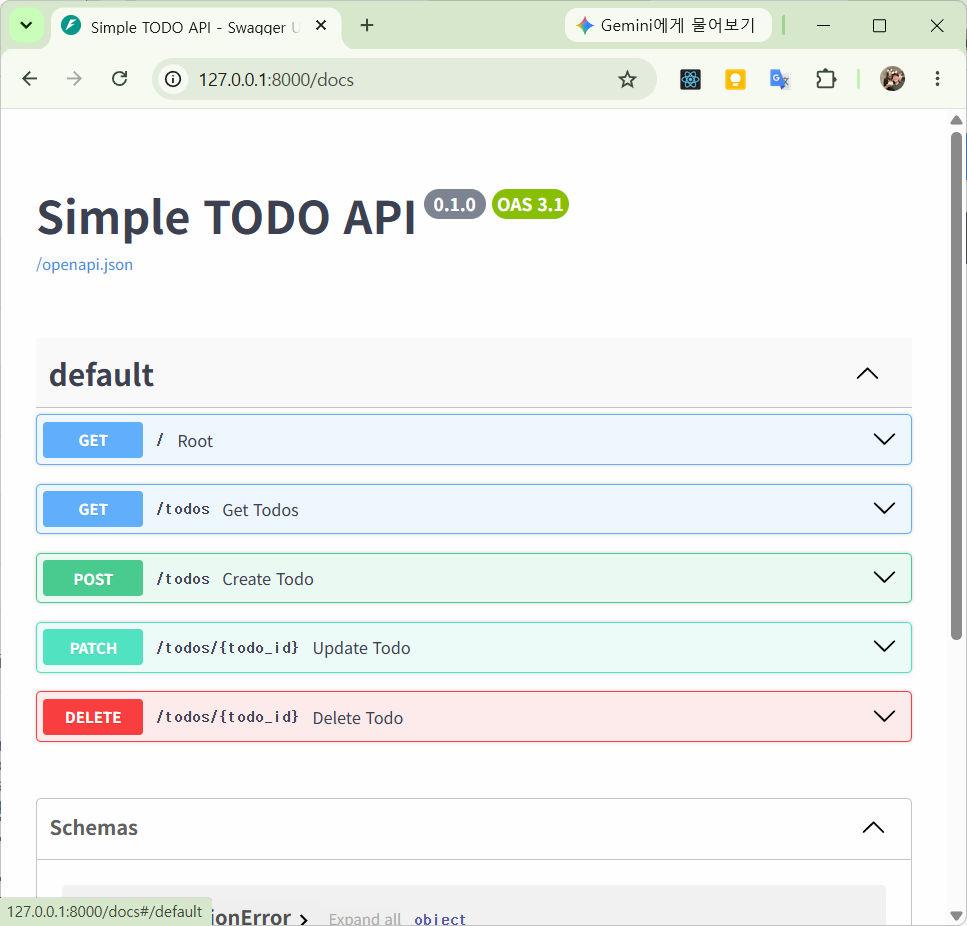

##### 예시 요청

```bash
# 할 일 추가
curl -X POST "http://127.0.0.1:8000/todos" \
  -H "Content-Type: application/json" \
  -d "{\"title\":\"FastAPI 공부하기\"}"

# 할 일 목록 조회
curl "http://127.0.0.1:8000/todos"

# 완료 상태 변경
curl -X PATCH "http://127.0.0.1:8000/todos/1" \
  -H "Content-Type: application/json" \
  -d "{\"completed\":true}"

# 할 일 삭제
curl -X DELETE "http://127.0.0.1:8000/todos/1"
```

##### 초보자용 코드 포인트

- `BaseModel`
  - 요청 본문과 응답 데이터를 쉽게 정의합니다.
- `todos: list[Todo]`
  - 메모리에 저장되는 할 일 배열입니다.
- `find_todo()`
  - `id`로 할 일을 찾는 헬퍼 함수입니다.
- `HTTPException`
  - 잘못된 요청이나 없는 데이터에 대해 에러를 돌려줍니다.

원하면 다음 단계로 이 TODO API에 맞는 간단한 HTML 프론트엔드도 붙여서, 화면에서 바로 CRUD가 되게 확장할 수 있습니다.

##### 추가 실행

```markdown
간단한 HTML 프론트엔드를 붙여서 브라우저에서 CRUD 되게 만들어줘
```

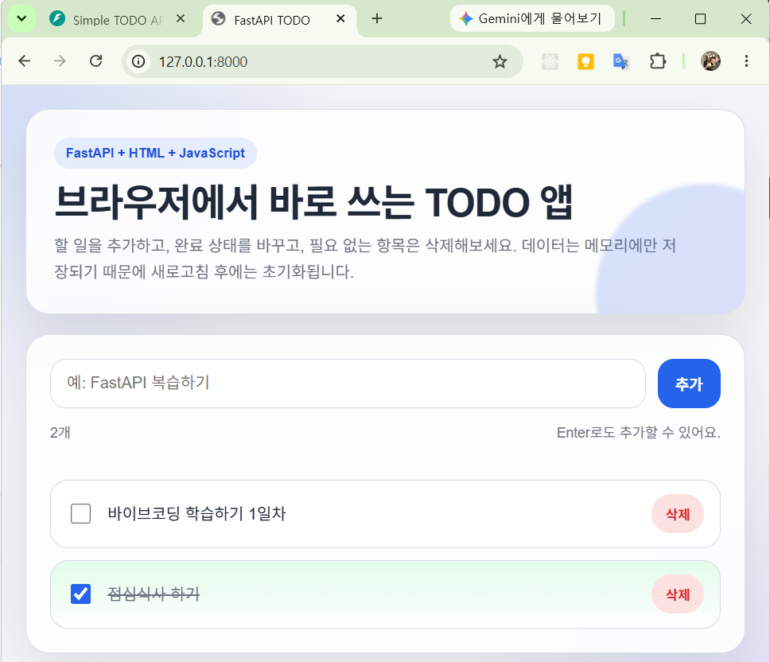

##### 다음 진행할 것

- 실제 DB와 연동해서 데이터를 DB에 저장하는 기능 구현


#### 5. PRD.md

- Product Requirments Document의 약자. 제품 요구사항 정의서
- AI에게 던져줄 설계도
- 마크다운으로 작성. 필요한 경우는 UI 이미지도 포함

##### 퍼즐게임 PRD 예시

- PRD.md 로 저장

```markdown
## 프로젝트: 간단한 퍼즐 게임

### 목표:
- 브라우저에서 실행되는 퍼즐 게임

### 기능:
- 퍼즐 보드 표시
- 클릭 이벤트 처리
- 클리어 조건 판단

### 기술:
- HTML, CSS, JavaScript
- 하나의 index.html 파일

### 대상:
- 코딩 초보자
```

```markdown
Day01\puzzle_game 아래에 PRD.md 파일 참조해서 만들어줘. UI는 ui.png 파일을 확인해서 만들면 돼.
```

##### 실행 결과 화면

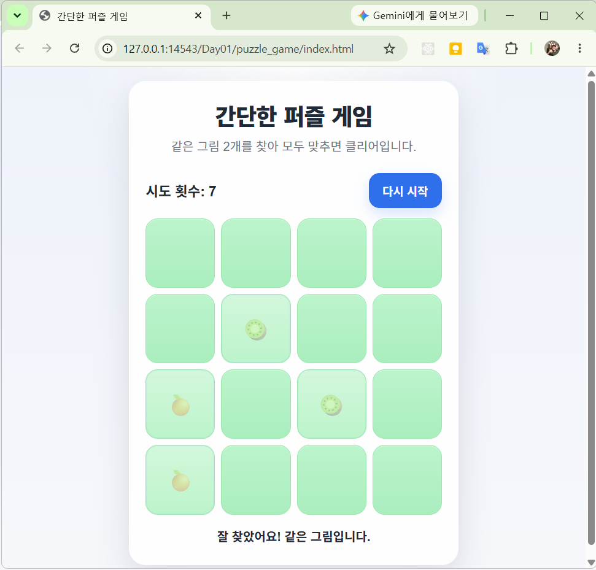

##### 분석 

- AI가 생성한 코드를 분석
- 소스코드 > context menu > ` Add to Codex Thread` 선택

- 바뀐 소스를 되돌리기 Ctrl + Z

- 오류(예외) 발생하는 코드 영역을 선택, Codex Thread 등 전달뒤 분석 요청

##### 리팩토링

- 원본 소스를 분석, 좀 더 나은 로직으로 변경하는 것

```markdown
현재 index.html을 더 깔끔하게 리팩토링 해줘.

조건:
- 기능은 그대로 유지
- 함수 최대한 분리
- 변수명은 SnakeCasing으로  
- 초보자도 이해 가능하게
- Js 스크립트에 주석 최대한 작성
- 변경 이유 설명
```
- 원본파일,  탐색기 > context menu > `비교를 위해서 선택`
- 변경된 파일, 탐색기 > context menu > `선택한 항목과 비교`

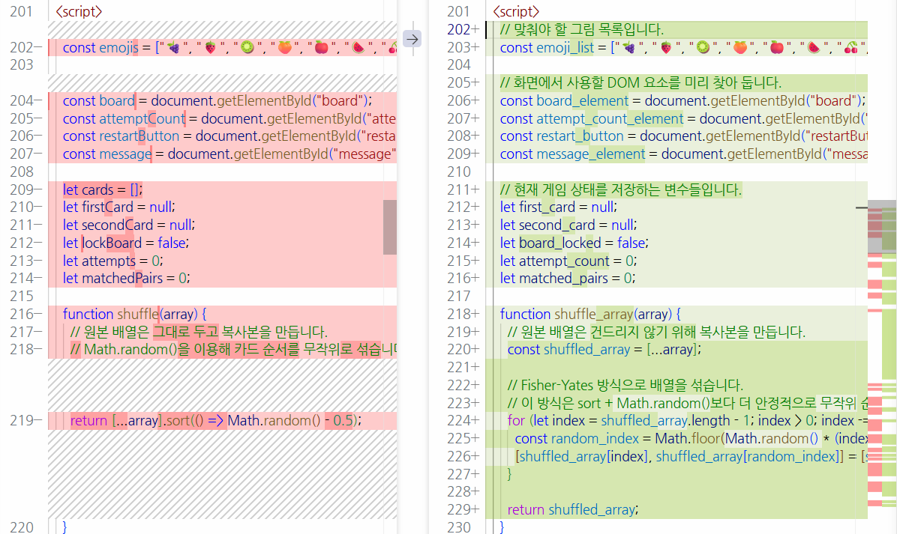

##### 예외처리 

- 실행 중 발생하는 오류
- 예외발생하는 구문 Codex Thread로 전송 후 프롬프트 작성, 실행

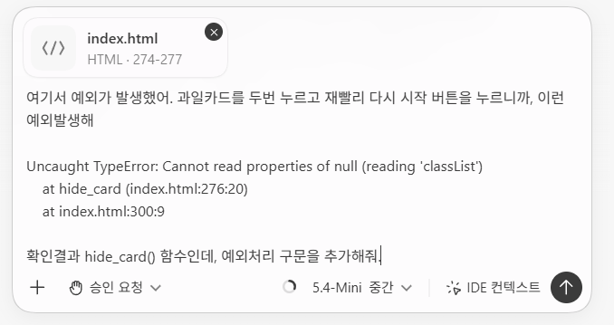

```js
    function hide_card(card_element) {    
      if (!card_element) {  // 예외발생 처리 결과
        return;
      }

      card_element.classList.remove("flipped");
    }
```

##### 구조 변경

- 예시

```markdown
현재 과일 이모지가 8개야. 갯수를 2배로 늘려서 랜덤하게 과일이미지가 바뀌게 정리해줘
```

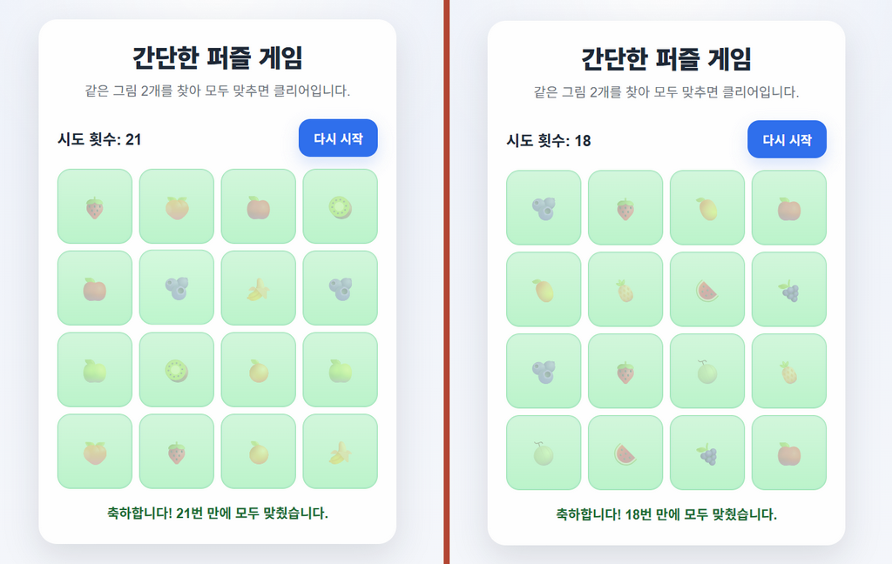

- 실행 시 마다 과일변경

##### 코드 설명 요청

- 예시

```markdown
Index.html에 자바스크립트 코드를 초보자에게 설명하듯이 블록 단위로 설명해줘.

- 외부라이브러리 확인 
- 엔트리포인트 확인
- 실행 흐름
```

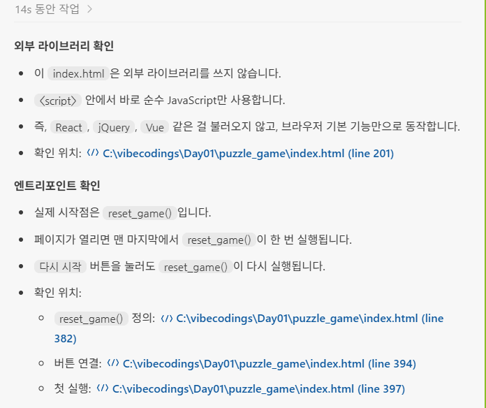